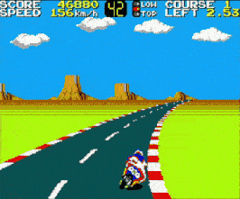

A fork of gym-retro ('lets you turn classic video games into Gym environments for reinforcement learning with additional games').
Since gym-retro is in maintenance now and doesn't accept new games, plateforms or bug fixes, you can instead submit PRs with new games or features here in stable-retro: [Github repo](https://github.com/MatPoliquin/stable-retro)


## Installation Ubuntu/Windows/MacOS:
```bash
pip install git+https://github.com/MatPoliquin/stable-retro.git
```


Join the *Discord channel* if you have questions, suggestions or want to participate in the development
[https://discord.gg/dXuBSg3B4D](https://discord.gg/dXuBSg3B4D)


## Tutorials

*   [Train models on Windows WSL2](https://www.youtube.com/watch?v=LRgGSQGNZeE)
*   [Integration tool tutorial](https://youtube.com/playlist?list=PLmwlWbdWpZVtH6NXqWbrnWOf6SWv9nJBY)
*   [New Emulator Integration Tutorial](https://github.com/openai/retro/issues/169)


