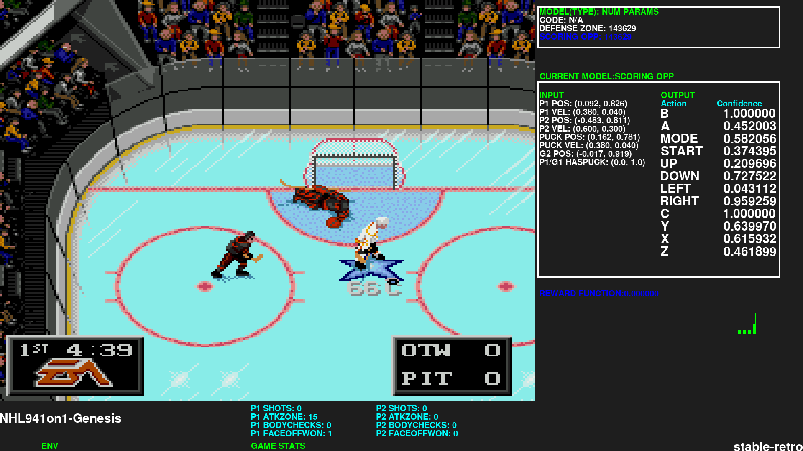
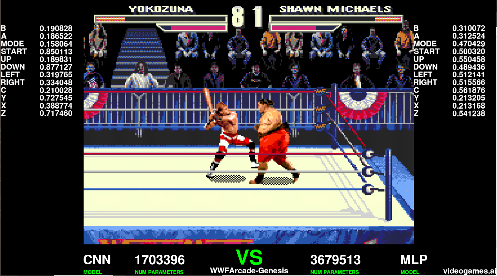
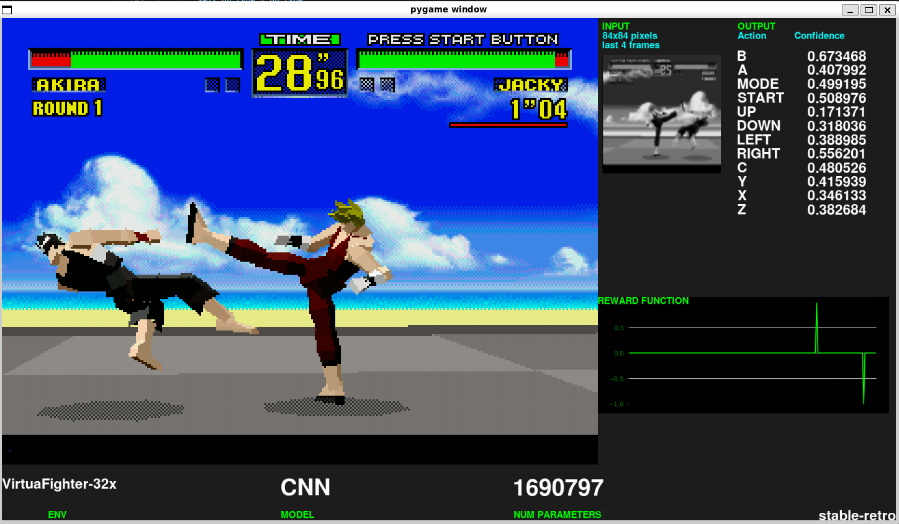

A maintained fork of gym-retro ('lets you turn classic video games into Gym environments for reinforcement learning').

Since gym-retro is in maintenance now and doesn't accept new games, plateforms or bug fixes, you can instead submit PRs with new games or features here in stable-retro:

[https://github.com/Farama-Foundation/stable-retro](https://github.com/Farama-Foundation/stable-retro)


## Installation Ubuntu/Windows/MacOS:
```bash
pip3 install git+https://github.com/Farama-Foundation/stable-retro.git
```


## Support and contribution
Join the *Discord channel* if you have questions, suggestions or want to participate in the development
[https://discord.gg/dXuBSg3B4D](https://discord.gg/dXuBSg3B4D)


## Tutorials

*   [Game Integration tool tutorial](https://www.youtube.com/watch?v=lPYWaUAq_dY&list=PLmwlWbdWpZVvWqzOxu0jVBy-CaRpYha0t)
*   [New Emulator Integration Tutorial](https://www.videogames.ai/2023/06/22/Integrate-emulator-stable-retro.html)
*   [Windows WSL2 + Ubuntu 22.04 setup guide](https://www.youtube.com/watch?v=vPnJiUR21Og)

## Examples

NHL94 (1 on 1)           |  Wrestlemania: The Arcade game |  Virtua Fighter 1
:-------------------------:|:-------------------------:|:-------------------------:
  |   | 

Train models on retro games and pit two models against each other on PvP retro games such as NHL94, Mortal Kombat or WWF Wrestlemania: The Arcade Game
[https://github.com/MatPoliquin/stable-retro-scripts](https://github.com/MatPoliquin/stable-retro-scripts)


## Supported Games and Plateforms

You can get the full list of games [here!](https://github.com/MatPoliquin/stable-retro/tree/master/retro/data/stable) 

Current plateforms:

*   Atari 2600 (via Stella)
*   NEC TurboGrafx-16/PC Engine (via Mednafen/Beetle PCE Fast)
*   Nintendo Game Boy/Game Boy Color (via gambatte)
*   Nintendo Game Boy Advance (via mGBA)
*   Nintendo Entertainment System (via FCEUmm)
*   Super Nintendo Entertainment System (via Snes9x)
*   Sega GameGear (via Genesis Plus GX)
*   Sega Genesis/Mega Drive (via Genesis Plus GX)
*   Sega Master System (via Genesis Plus GX)
*   Sega 32x
*   Sega CD
*   Sega Saturn
*   Arcade Hardware supported by FBNeo


## RAM maps

*   [NHL94 ram map](./nhl-94-ram-map)
